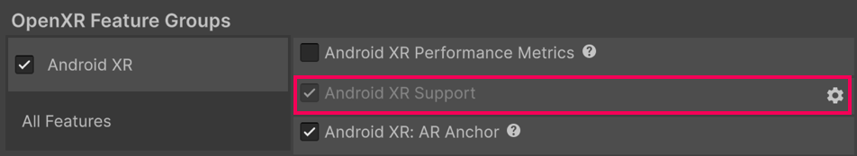
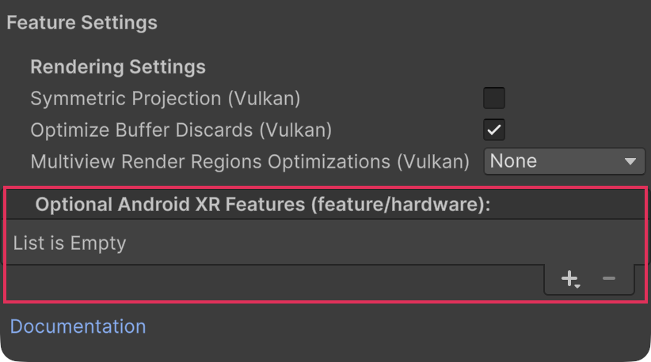

# Android XR Support

Understand the options available in the **Android XR Support** feature.

When you [Enable Android XR](xref:androidxr-openxr-project-setup#enable-unity-openxr-android-xr), you can use the **Android XR Support** feature to configure Android XR platform settings.

## Access the Android XR support window

To open the **Android XR Support** window:

1. Open the **OpenXR** section of **XR Plug-in Management** (menu: **Edit** > **Project Settings** > **XR Plug-in Management** > **OpenXR**).
2. Under **All Features**, enable **Android XR Support**.
3. Use the gear icon to open the **Android XR Support** window.

 *Use the gear icon to open the **Android XR Support** window.*

## Settings reference

The following options are available in the **Android XR Support** window:

| **Setting** | **Description** |
| :---------- | :-------------- |
| **Symmetric Projection (Vulkan)**  | If enabled, when the application begins it creates a stereo symmetric view that changes the eye buffer resolution based on the Inter-Pupillary Distance (IPD). Provides a performance benefit across all IPD values. |
| **Optimize Buffer Discards (Vulkan)** | Enable this setting to allow 4x Multi Sample Anti Aliasing (MSAA) textures to be memoryless on Vulkan. |
| **Multiview Render Regions Optimizations (Vulkan)** | Choose whether you enable Multiview Render Regions optimization and the mode of Multiview Render Regions optimization. In Unity 6.2 and newer, the options are: **None**, **All Passes**, **Final Pass**. To learn more about this feature, refer to [Multiview Render Regions](xref:openxr-multiview-render-regions) (OpenXR). |
| **Optional Android XR Features (feature/hardware)** | Use this list to mark eligible enabled Android XR features and interaction profiles as optional for Android manifest generation. Only enabled items with relevant Android hardware requirements appear in the list. |

### Optional Android XR features and compatibility

The **Optional Android XR Features (feature/hardware)** list lets you reduce hardware requirements for selected Android XR features and eligible interaction profiles. Unity uses this list when it generates the Android manifest.

 *Use the Add (**+**) and Remove (**−**) buttons to add or remove items from the **Optional Android XR Features** list.*

Unity treats the selected items as optional during manifest generation. Unity marks the associated Android hardware features as `android:required="false"` only if no other enabled feature or interaction profile that's not in the optional list also depends on that same hardware. Otherwise, the hardware remains required. Disabled features aren't included in this computation.

> [!IMPORTANT]
> Marking a feature as optional only changes how Unity declares the associated hardware requirement in the Android manifest. Unity doesn't provide fallback behavior automatically. If your app can run without that capability, you must detect that case at runtime and implement appropriate fallback logic.

Optional features don't increase the minimum required Spatial API version. Unity computes this value automatically by checking the OpenXR extensions used by required features against Google’s extension-to-Spatial-API-version mapping. Unity then writes the highest mapped Spatial API version required by those extensions to the Android manifest. Unity excludes extensions used only by optional features from this computation.

> [!NOTE]
> If no required feature needs a higher Spatial API version, Unity uses the baseline Spatial API version in the manifest.

#### Add an Optional Android XR Feature

To add an eligible optional Android XR feature to the list:
1. Select the Add (**+**) button.
2. From the dropdown, select an eligible enabled feature or interaction profile.

#### Remove an Optional Android XR Feature

To remove a feature or interaction profile from the list:
Select the Remove (**−**) button. Removing an item treats the associated Android hardware feature as required during manifest generation unless it's only used by other optional items.

> [!NOTE]
> The dropdown only lists enabled items that have relevant Android hardware requirements. Items without that mapping don’t appear.

## Android XR Optional Hardware Feature Mappings

The following tables map Unity Editor features and their underlying OpenXR extensions to the specific Android hardware capabilities and permissions they require. You can use this reference to determine exactly which settings to adjust to make specific hardware dependencies optional.

### Eye Tracking

| Android Manifest Requirement & Permissions | Unity Editor Feature | Underlying OpenXR Extension / Profile |
| :--- | :--- | :--- |
| `android.hardware.xr.input.eye_tracking` & `android.permission.EYE_TRACKING_COARSE` / `FINE` | Android XR: AR Face | `XR_ANDROID_eye_tracking` & `XR_ANDROID_face_tracking_data_source` |
| `android.hardware.xr.input.eye_tracking` & `android.permission.EYE_TRACKING_COARSE` / `FINE` | Eye Tracking Calibration | `XR_ANDROID_eye_tracking_calibration_state` |
| `android.hardware.xr.input.eye_tracking` & `android.permission.EYE_TRACKING_COARSE` / `FINE` | Eye Gaze Interaction Profile | `XR_EXT_eye_gaze_interaction` |
| `android.hardware.xr.input.eye_tracking` & `android.permission.EYE_TRACKING_COARSE` / `FINE` | Meta Foveated Rendering | `XR_META_foveation_eye_tracked` |
| `android.hardware.xr.input.eye_tracking` & `android.permission.EYE_TRACKING_COARSE` / `FINE` | Varjo Foveated Rendering | `XR_VARJO_foveated_rendering` |

### Hand Tracking

| Android Manifest Requirement & Permissions | Unity Editor Feature | Underlying OpenXR Extension / Profile |
| :--- | :--- | :--- |
| `android.hardware.xr.input.hand_tracking` & `android.permission.HAND_TRACKING` | Hand Tracking Subsystem | `XR_EXT_hand_tracking` |
| `android.hardware.xr.input.hand_tracking` & `android.permission.HAND_TRACKING` | Hand Interaction Profile | `XR_EXT_hand_interaction` |
| `android.hardware.xr.input.hand_tracking` & `android.permission.HAND_TRACKING` | Android XR: Hand Mesh | `XR_ANDROID_hand_mesh` |
| `android.hardware.xr.input.hand_tracking` & `android.permission.HAND_TRACKING` | Meta Hand Tracking Mesh | `XR_FB_hand_tracking_mesh` |
| `android.hardware.xr.input.hand_tracking` & `android.permission.HAND_TRACKING` | Meta Hand Tracking Aim | `XR_FB_hand_tracking_aim` |
| `android.hardware.xr.input.hand_tracking` & `android.permission.HAND_TRACKING` | Palm Pose | `XR_EXT_palm_pose` |

### Controllers

| Android Manifest Requirement & Permissions | Unity Editor Feature | Underlying OpenXR Extension / Profile |
| :--- | :--- | :--- |
| `android.hardware.xr.input.controller` | DPad Binding | `XR_EXT_dpad_binding` |
| `android.hardware.xr.input.controller` | Meta Color Space | `XR_FB_color_space` |
| `android.hardware.xr.input.controller` | Oculus Touch Controller Profile | `/interaction_profiles/oculus/touch_controller` |
| `android.hardware.xr.input.controller` | Khronos Simple Controller Profile | `/interaction_profiles/khr/simple_controller` |

## Additional resources

* [Configure project settings](xref:androidxr-openxr-project-setup)
